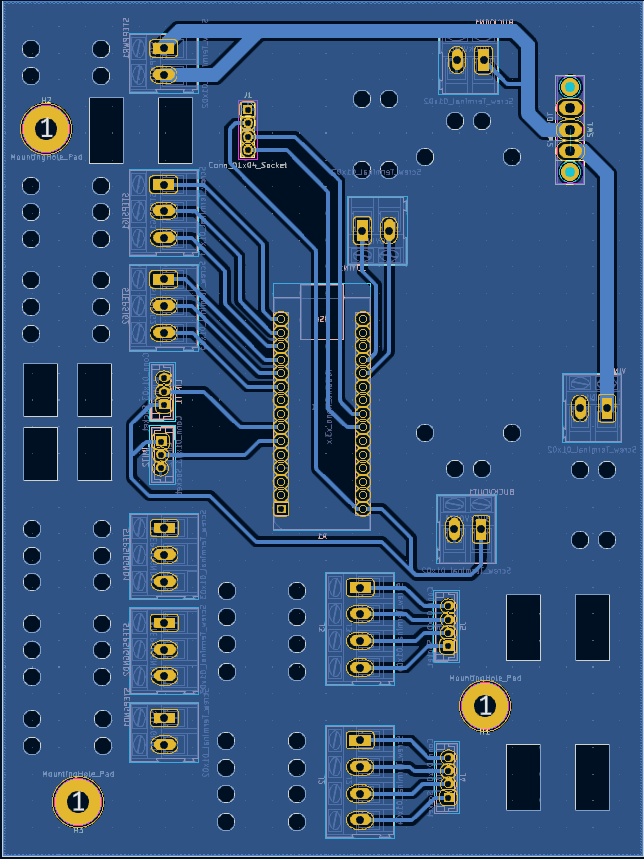

# yorglabsuperrespcb

# Table of Contents
1. [SUMMARY](#SUMMARY)
2. [PCB](#PCB)
3. [CODE](#CODE)
4. [OPERATION](#OPERATION)

## SUMMARY

## PCB
  
  
  The PCB looks nasty, but is more simple than it appears, at first.

## CODE
## OPERATION