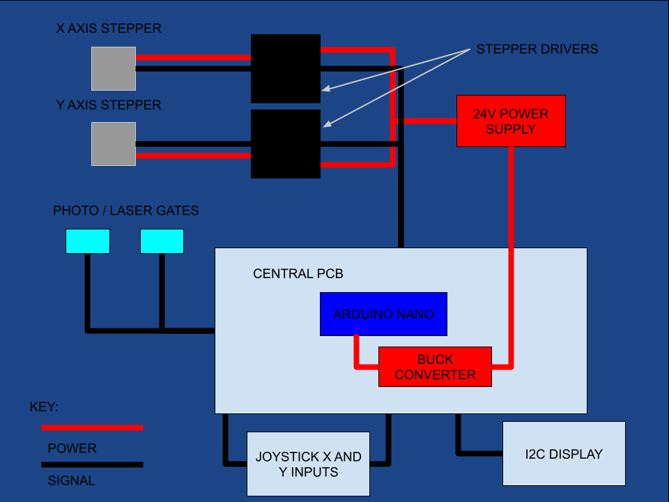
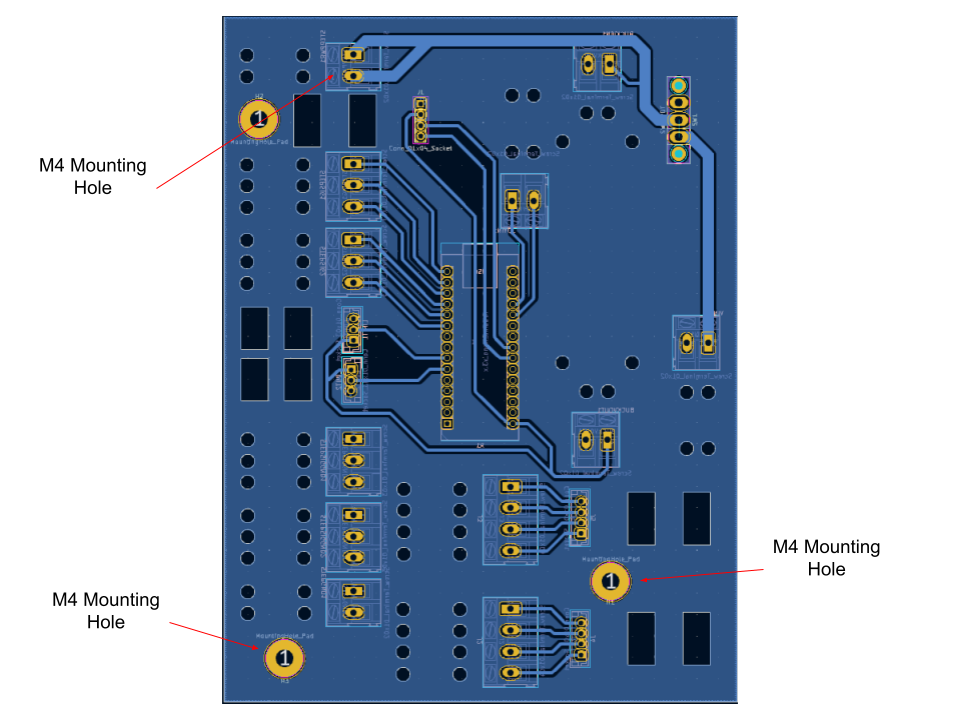
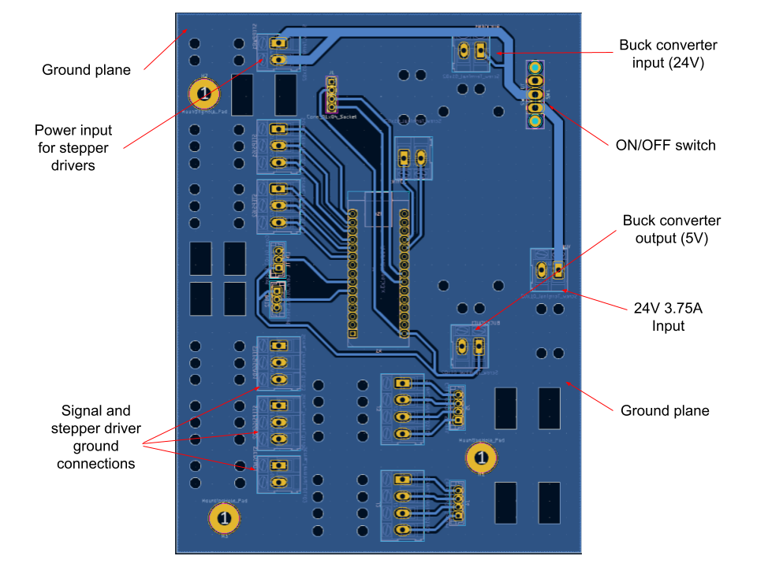
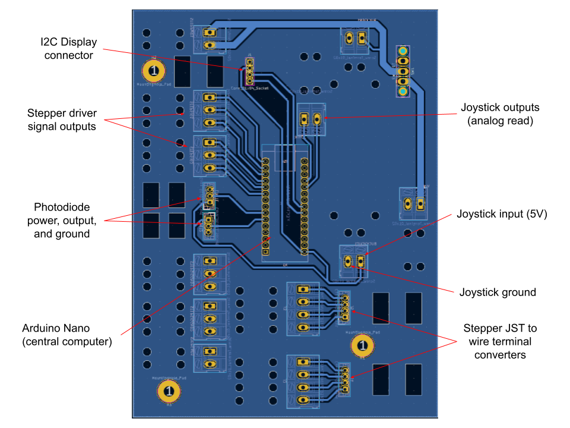

# yorglabsuperrespcb

# Table of Contents
1. [SUMMARY](##SUMMARY)
2. [PCB](##PCB)
3. [CODE](##CODE)
4. [OPERATION](##OPERATION)

## SUMMARY

## PCB
  ### Overview
  
  
  The PCB looks nasty, but is more simple than it appears, at first.
  ***
  ### Where Was it Milled?
  Just as some general background, the board was milled and cut out at the BYU Electrical Engineering Experiential Learning Center. At the time of manufacture, they had yet to integrate solder masks. So, any pictures given of the fully-assembled board will show only *bare copper*. Future iterations should have a solder mask for safety reasons.
  ***
  ### Tension Relief Holes
  
  
  Probably the most striking thing to see, at first, are the tension relief holes. You thread the wires or ribbon cables through them like a needle and thread. This makes it so that the tension of any motion / movement on the wires from the outside is transfered to the board instead of the connectors. This adds durability to the board, but also makes it so that it's more complicated to manufacture. Luckily, the BYU Electrical Engineering Experiential Learning Center was able to mill it with little issue.
  ***
  ### Mounting Holes
  

  These help mount the PCB to a backing plate. These aren't utilized in our current setup.
  ***
  ### Power Network
  
  ***
  ### Signal Network
  
  
  A note about the joystick: the joystick is comprised of two potentiometers (variable resistors). The Nano is able to convert voltage inputs from 0V - 5V and convert it to a value of 0 - 1024 using `analogRead([pin name])`. By running the output of the variable end of the potentiometer to a pin corresponding to the X and Y axis, we're able to measure the angle at which the joystick is currently at. This helps to inform the speed each motor takes on. The more extreme the angle of the joystick on a particular axis, the faster the motor on that particular axis is.
  ***

## CODE
  ### Limitations
  The code isn't perfect. Memory leaks and other performance issues may exist. In addition, the code doesn't neccessarily *need* to be in a single file. Other issues may exist to others. Input in the "issues" page of this repo would be much appreciated. Because an arduino nano cannot support multithreading, minimizing memory leaks and improving speeds are paramount.

  The photogates also aren't used, currently. Therefore, there is no safety preventing the device from moving beyond its intended limits. This is a *major* bug that needs to be fixed immediately.
  ***
  ### Methodology
  In general, any variable used is either inumerated using the `#define` command or is passed by reference. This helps improve the speed at which the code iterates and the amount of memory used. These things can still be improved upon, however.
  ***
  This code is broken up into three distinct sections: perception, planning, and action.
  ```cpp
  perception();
  ```
  This is where the inputs from the various sensors the nano uses are measured and saved. Currently, just the input of the joystick is read, but in the future, this is where one would check whether or not the laser gates are tripped or not, for example.
  ```cpp
  planning();
  ```
  This is where actions are prepped. In our case, this is where the direction and speed of the stepper motors is calculated.
  ```cpp
  action();
  ```
  In this section, the nano executes the actions we had prepared.
  
  *Every other method in the code is an appendage to these three methods*
  
  ***
  ### Startup
  An attempt was made to create a movement sequence that would automatically "home" the stage, setting the stepper's default state to one extreme of their movement. This would allow the laser gates to prevent the stage from moving beyond their limits. This was never acheived. This also makes it so that the I2C display doesn't display location information (another desired goal with startup)
  ### Custom Step Signal
  In order for each stepper to increment, the "step" pin needs to receive a distinct off-on-off pattern. The rate at which these patterns come in dictates the rate at which the stepper increments, changing its speed. 
  The Arduino Nano's hardware natively supports "pulse width modulation" (PWM) that *could* be used to accomplish this. However, PWM signals are generally set at a specific frequency. This would make it so that the steppers would step at a fixed rate regardless of the joystick's orientation. 
  
  Because of these limitations, a way of delivering this signal was created using the Nano's internal clock and digital pins:
  ```cpp
  void move_stepper(const unsigned int& step_pin, unsigned long& time_index, const unsigned int& time_tolerance, const unsigned int& direction_bool, int64_t& num_steps, const int& ena) {
    if ((micros() - time_index) > time_tolerance) {
      digitalWrite(step_pin, HIGH);
      digitalWrite(step_pin, LOW);
      if (ena == LOW) {
        if(direction_bool == HIGH) {
          num_steps++;
        }
        else if (direction_bool == LOW) {
          num_steps--;
        }
      }
      time_index = micros();
    }
  }
  ```
  At its core, this method manually defines how long the arduino takes in-between stepping each motor. This is done by storing when the nano begins to wait using the `micros();` command, then measuring how much time has past. If the elapsed time is larger than the defined wait time, the nano commands the stepper to take a single step, the number of total steps that stepper has taken is recorded, and the process begins again. 
  The wait time is defined at the very top of the file. See the variables `slowest_speed`, `second_fastest`, `second_slowest`, and `fastest_speed` in the `#define` section of the code.
  ***
## OPERATION
Ensure every wire is connected to where it needs to be connected to. Position the stage so the path of the photodiodes is blocked by their corresponding metal fin. Plug the stage's power supply into a wall socket. Turn the motherboard on by flipping the switch. A blue and red indicator light from the buck converter and Arduino Nano respectively should come on immediately. From then on, use the joystick to move the stage. The higher the angle of the joystick in either direction, the faster the steppers will step in that direction.